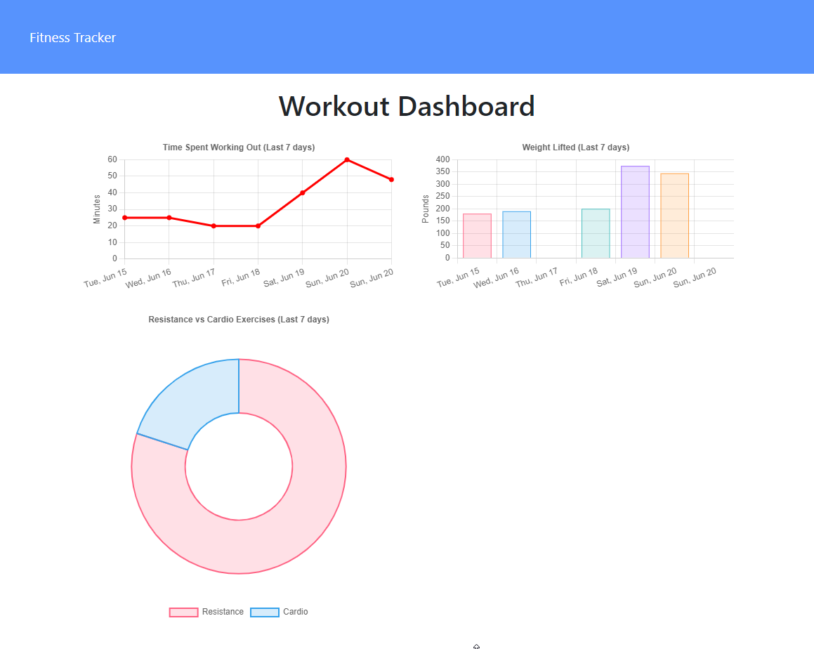

# **Fitness Tracker**
 &emsp;&emsp;

&nbsp;
## **Table of Contents**
  - [**Description**](#description)
  - [**Live Application**](#live-application)
  - [**Application Screenshots and Demo**](#application-screenshots-and-demo)
  - [**Technologies and Services**](#technologies-and-services)
  - [**License**](#license)

&nbsp;
## **Description**
Fitness tracker provides a simple workout and stat tracking application. From the app home screen  a user can log a new workout or log a new exercise to the latest workout. Upon starting or continuing a workout the user can select to log a resistance or cardio based exercise which will provide them unique exercise metrics to record. A summary of the latest seven workouts of the user can be viewed on the dashboard page.

Fitness tracker is a full stack web application following the MVC design paradigm. It uses mongoDB as its NoSQL database and mongoose.js as the object document mapper. Views are provided from the server as static HTML files and include associated JavaScript to handle dynamic rendering changes on the client without interaction with the server. The server runs on node.js and uses the express web framework. 

The web application is hosted on Heroku for demonstration.

&nbsp;
## **[Live Application](https://spf-fitness-tracker.herokuapp.com/)**
## **Application Screenshots and Demo**

&nbsp;
## **Technologies and Services**
Development Technologies
- Database/Models: MongoDD, Mongoose (ODM)
- Client/Views: HTML, CSS, JavaScript
- Server/Controllers: Node.js, Express.js

External Frameworks, Services, and Credits
- Favicon <a href="https://icons8.com/icons/set/fitness">fitness icon</a> from <a href="https://icons8.com/">Icons8</a>

&nbsp;
## **License**
Licensed under the [MIT](./LICENSE) license.